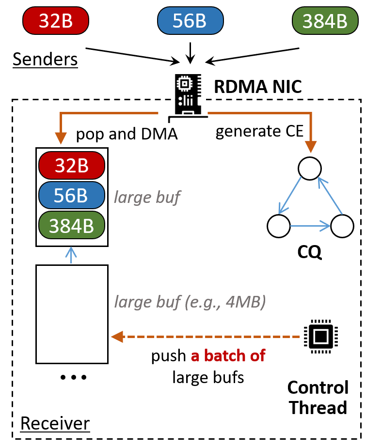

# Rowan (<ins>R</ins>em<ins>o</ins>te <ins>W</ins>rite <ins>A</ins>ggregatio<ins>n</ins>)

Rowan is a one-sided primitive supporting concurrent appends
(it is the key component of our OSDI'23 [paper](https://www.usenix.org/system/files/osdi23-wang-qing.pdf)).
It is achieved by the following techniques:
* **RC send/recv verbs**, which let RNICs generate hardware ACKs and let receiver assign addresses
* **Multi-packet SRQ**, which merges variable-sized data from different sources.
* **Ring CQ**, which eliminate CQ polling (see NSDI 19 paper eRPC).

## Getting Started

- `cd Rowan`
- `mkdir build; cd build; cmake ..; make -j`
- `cp ../script/restartMemc.sh .`
- configure `../memcached.conf`, where the 1st line is memcached IP, the 2nd is memcached port
- execute `./restartMemc.sh` (to initialize memcached, which is required for each run)
- execute `./rowan_server`; then execute `./rowan_client`;

## System Requirements

1. Mellanox ConnectX-5 NICs and above
2. RDMA Driver: MLNX_OFED_LINUX-4.* (Higher versions of the driver do not support Multi-packet RC QPs, OFED)
3. Infiniband network (RNICs in RoCE mode do not support Multi-packet RC QPs).